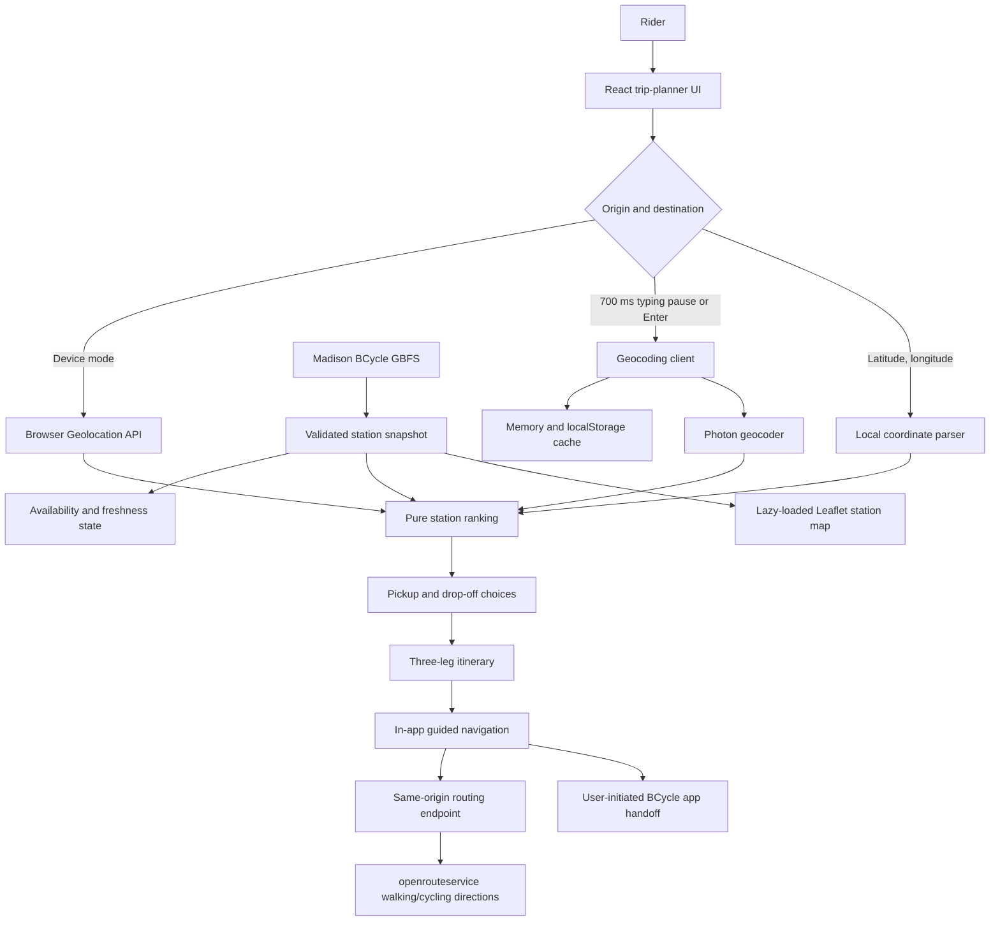

# BRouter

[Open the deployed application](https://bcycle-router.netlify.app/)

BRouter is an independent trip-planning and navigation aid for Madison, Wisconsin's
BCycle system. It addresses a practical bike-share problem: a useful trip needs
both a rentable bike near the starting point and an open return dock near the
destination.

The app combines live GBFS station availability with a user-entered or
device-provided origin and destination. It ranks nearby pickup and drop-off
choices and lets the rider choose alternatives. **Go to navigation** opens a full
viewport map with walking, cycling, and final walking directions. A starting
location alone can also open navigation to the selected pickup. BRouter does not
unlock bikes, reserve equipment, buy passes, or confirm a rental return.

<p align="center">
  <video
    src="https://github.com/user-attachments/assets/e3689c4c-f612-4196-b2c7-ded43c66002c"
    width="960"
    height="540"
    controls
    muted
    loop
    playsinline
  >
    Your browser does not support the video tag.
  </video>
</p>

## What the app does

- Enter a **Starting location**, or press the location icon beside the field to
  use the browser's current location. Editing the field switches back to an address.
- **Clear** resets both address fields, station choices, and the planned trip.
  Pending searches and location requests cannot refill the cleared fields.
- Runs origin and destination address search after a 700 ms typing pause once
  at least three characters are present. Enter selects the first visible result;
  latitude/longitude input is validated locally without a geocoding request.
- Bounds all address requests to the current station area and removes matches
  farther than one mile from every installed station.
- Loads and validates Madison BCycle station information and status feeds.
- Distinguishes operational, no-bike, no-dock, service-disabled, stale, and
  unavailable states without treating zero bikes as a seasonal closure.
- Recommends up to three eligible pickup stations and three eligible drop-off
  stations within one mile, with the first option selected by default.
- Updates the selected trip immediately when the rider chooses another station.
- Shows an optional, lazy-loaded Leaflet map and an approximate station-coverage
  hull. This visualization is not an official service boundary.
- Installs as a PWA. The compiled app shell can load offline, while live station
  planning still requires a network connection.

The planner keeps the starting point, destination, station choices, and navigation
action up front. Address entry and the current-location button share one row.
The optional station map sits below the trip; About and install details stay
collapsed. Routine refresh messages, timestamps, and device coordinates stay out
of the interface. Short, actionable messages appear when help is needed.

## Architecture and data flow

The application is a React and TypeScript SPA with a small server endpoint for
openrouteservice directions. The routing API key stays on the server. There is
no BRouter account system or server-side trip store; the active journey and
rerouting preference are saved on the rider's device.



Responsibilities are intentionally separated:

- `src/lib/gbfs.ts` loads, validates, caches, and timestamps station snapshots.
- `src/services/geocodingClient.ts` handles Photon searches, station-area
  bounds and filtering, coordinate parsing, throttling, cancellation, and cache
  persistence.
- `src/lib/stations.ts` contains deterministic station eligibility and ranking.
- `src/lib/tripPlanner.ts` creates the three-leg itinerary and straight-line
  planning estimates.
- `src/features/trip-planner/` owns planner state, while focused components
  render search, station choices, service status, results, and the station map.

## Station ranking

Pickup candidates must be installed, enabled for rentals, have valid
coordinates, and report at least one bike. Drop-off candidates must be
installed, enabled for returns, have valid coordinates, and report at least one
dock.

For each endpoint, the ranking algorithm:

1. Calculates Haversine distance to every eligible station.
2. Removes stations farther than the configured 1.0-mile maximum.
3. Always places the closest eligible station first.
4. Adds the true next closest unused station second.
5. For the remaining position, adds the station with the highest relevant
   availability among the unused candidates only when it reports more than the
   closest station: bikes for pickup or docks for drop-off. Otherwise, it uses
   the nearest remaining station.
6. Returns at most three candidates. Effectively identical distances use the
   relevant bike or dock availability first, then stable station IDs.

The first candidate is recommended and selected by default. The chosen pickup
is excluded from drop-off choices when another eligible return station exists.
Each option is labeled to explain whether it is the closest, offers more bikes
or docks, or is the next closest. Selections with only one bike or one dock
receive a visible warning.

## Distances and in-app routes

Station-choice distances are **straight-line estimates** calculated with the
Haversine formula. They are not actual walking or cycling distances, travel
times, or guarantees that a route exists.

The result is split into up to three navigation legs:

1. Walk from the starting location to the selected pickup station.
2. Cycle from the pickup station to the selected drop-off station.
3. Walk from the drop-off station to the final destination.

**Go to navigation** starts the complete trip at pickup. The planner has no
separate itinerary cards; walking and cycling legs are selected inside navigation.
All route actions remain in BRouter.

## Guided navigation

After choosing all four trip points, press **Go to navigation**. The map fills the
app viewport and starts with the walk to pickup. If only the starting location
has been chosen, **Navigate to pickup** opens a pickup-only journey without a leg switcher. Directions
and distances in navigation use openrouteservice routes, rather than the planner's
straight-line estimates. Time remaining is an estimate based on the provider's
route duration and progress.

The **Open BCycle app** button appears near the active station when a location
fix is recent (at most 30 seconds old), accurate to 50 meters or better, and the
distance plus reported accuracy is within 100 meters. It uses the general
`bcycle://` launch URI advertised by Madison's GBFS system metadata. This is the
only navigation action that leaves BRouter, and it does not send an unlock,
purchase, or return command. Returning to BRouter does not change the active leg;
the rider chooses the next or previous leg with the stage controls at the bottom
of the navigation screen.

The app cannot determine whether BCycle actually unlocked or accepted a bike.
The launch URI needs verification on a physical phone with BCycle installed;
automated tests can only simulate that boundary. Fullscreen means the
available app viewport, not guaranteed removal of operating-system browser chrome.
An entered starting address opens a route-only view, even if the browser already
allows location access. It shows the selected leg, route, distance, and duration,
with no GPS or compass access, location marker, follow control, turn prompts, or
arrival clock. This choice persists after reload; older saved trips default to
the route-only view.

Pressing **Use my location**, the location icon beside **Starting location**, enables
live navigation. The field shows **My location** after selection. Existing location
permission shows the current position and accuracy circle automatically. Approximate
positions remain visible, while proximity actions and automatic route updates still
require an accurate fix. The location button can request access again when needed.

In live navigation, press the location button to zoom in and follow movement.
The map turns so the direction the phone faces points upward, with the location
arrow and cone aligned to it. The phone's compass supplies the heading when available;
the button requests device-orientation permission on browsers that require it.
GPS travel direction is the fallback; no reliable heading displays a location dot
and a north-up map. Dragging pauses following and rotation; press the location
button to resume. **Show route** restores the north-up overview. GPS and compass
tracking work while the app is visible. Screen wake lock is requested where
supported and released when navigation ends or hides.

Station availability refreshes silently every 15 seconds during navigation, pauses while
hidden, and refreshes on return. Existing counts stay visible during background
refreshes, without freshness labels or refresh warnings. **Navigation options → If a station becomes
unavailable** offers **Ask me first** (default) and **Change route automatically**.
Only fresh, successful station data can trigger a station replacement. The
pickup walk checks pickup and planned return availability; riding checks only
the return station; the final walk does not change stations. Selecting a previous
leg resumes the checks for that leg. Alternatives remain within the planner's one-mile endpoint radius. If
none exists, the app explains the problem and retains the selected destination.

Active journey state is stored locally under `brouter:journey:v1`, validated on
reload, and expires after twelve hours without a journey-state update. GPS samples
are not persisted. Ending navigation clears the saved journey. The rerouting
preference is saved separately under `brouter:reroute-mode:v1`. Offline route
updates and fresh availability require connectivity; no fake straight-line
navigation route is substituted when a directions request fails.

### Free routing setup

1. Create a free [openrouteservice account and API key](https://openrouteservice.org/dev/).
2. For local development, create `.env.local` in the project root with:

   ```dotenv
   OPENROUTESERVICE_API_KEY=your_key_here
   ```

3. Restart `npm run dev` or `npm run preview` after adding the key. The Vite
   development/preview server forwards the routing endpoint locally.
4. Before a future Netlify deployment, set `OPENROUTESERVICE_API_KEY` as a Netlify
   environment variable available to **Functions**. Do not prefix it with `VITE_`
   or commit it. Netlify serves the endpoint at `/.netlify/functions/route`.

Without the key, navigation reports that routing is not configured and offers a
retry; station and journey features still work. The free service has usage
limits ([current plans](https://openrouteservice.org/plans/)). Requests are cached
and throttled, and provider errors or exhausted limits are shown in the app.
The public Valhalla demo is not used as a production dependency.

## Live station data and freshness

BRouter first checks the Madison BCycle GBFS discovery document and falls back
to documented station-information and station-status endpoints when discovery
cannot resolve both feeds. The feeds are fetched in parallel with an eight-second
request timeout. External JSON is validated at runtime; malformed individual
stations can be skipped safely, negative availability values are clamped to
zero, and an unusable overall feed fails clearly.

A successful load produces a snapshot containing the stations, local fetch
time, provider update time and TTL when present, and a stale flag. Freshness is
derived from provider metadata; a documented 15-second fallback threshold is
used when usable metadata is absent.

Normal loads use a short 15-second in-memory cache and deduplicate concurrent
requests. The app checks again automatically. If a refresh fails after a valid
load, the last successful snapshot remains visible while background checks continue
silently. If no valid snapshot exists, the app offers a retry without showing
technical feed errors. Freshness is still checked internally before navigation
can replace a station.

## Address search, attribution, and privacy

Address results come from [Photon](https://photon.komoot.io/) using OpenStreetMap
data and are limited to five matches. Both address fields search automatically
after the rider pauses typing for 700 ms once at least three characters are
present. Enter remains an immediate shortcut and selects the first visible
result when no result is active. A coordinate pair is parsed locally and must
contain a latitude from -90 through 90 and longitude from -180 through 180.

Address requests use Photon's bounding-box parameter. The box is derived from
current installed station coordinates and expanded by the same one-mile walking
radius used by the planner. Returned points are then filtered locally so a
rectangular bounding box cannot admit a match more than one mile from every
installed station.

The geocoding client normalizes cache keys, keeps a bounded 100-entry memory and
versioned `localStorage` cache for seven days, tolerates unavailable browser
storage, cancels obsolete requests, and spaces outbound Photon requests by at
least one second. Service-area identity is part of bounded cache keys, so stale
matches are not reused after the station area changes. Cached matches may be
reused without another request.

Pausing after at least three characters or pressing Enter sends that text
directly from the browser to Photon, whose operator may receive normal request
metadata such as the user's IP address. Address queries are not sent to BRouter's
routing endpoint. During navigation, the coordinates needed to request a route
are sent through that endpoint to openrouteservice. Route requests and the API
key are not written to application logs, and routing responses use `no-store`.
[OpenStreetMap contributor attribution](https://www.openstreetmap.org/copyright)
is shown in the map controls whenever the optional map is open.

## Accessibility

- Address search uses semantic forms and a WAI-ARIA combobox/listbox pattern.
- Arrow keys move through results, Enter selects, and Escape closes the list;
  pointer selection remains available.
- Search progress and relevant station changes use polite live announcements,
  while actionable errors are identified separately. Routine successful station
  refreshes remain silent.
- Logical headings, visible labels, non-color map symbols, strong
  `:focus-visible` styling, WCAG-AA button contrast, and practical touch targets
  support keyboard, screen-reader, and touch use.
- Page zoom and pinch zoom are not disabled.
- Playwright runs Axe checks that fail on serious or critical violations in the
  tested flows.

## Local development

Requires Node.js 20.19 or newer and npm.

```bash
npm ci
npm run dev
```

Vite serves the app at the URL printed in the terminal, normally
`http://localhost:5173/`.

Create and inspect the production build:

```bash
npm run build
npm run preview
```

## Verification commands

```bash
npm run typecheck
npm run lint
npm run format:check
npm test
npm run build
npx playwright install chromium webkit
npm run test:e2e
```

Unit and component tests use Vitest and React Testing Library. End-to-end tests
use Playwright with intercepted local fixtures rather than relying on live
Madison BCycle, Photon, OpenStreetMap, or openrouteservice responses.

To apply repository formatting, run `npm run format`.

## Netlify deployment

The checked-in `netlify.toml` is the deployment contract:

- build command: `npm run build`
- publish directory: `dist`
- SPA navigation fallback: `index.html`
- failed JavaScript, CSS, image, icon, manifest, and service-worker asset paths:
  explicit 404 responses rather than the SPA HTML fallback

Netlify reads those settings automatically and builds the routing function in
`netlify/functions/route.ts`. Before deploying, configure the server-only
`OPENROUTESERVICE_API_KEY` environment variable for Functions as described in
**Free routing setup** above. The planner works without a key; in-app directions
require it.

`vite-plugin-pwa` generates the Workbox service worker during the production
build. It precaches the compiled app shell, has no runtime cache for live GBFS,
geocoding, or routing responses, and does not use `index.html` as a failed-asset response.

## Limitations

- BRouter supports Madison BCycle only; it is not a multi-city planner.
- The coverage hull is computed from current installed station locations and is
  only an approximation, not an official or complete service boundary.
- Live station reports can be delayed or change between planning and arrival.
  A recommendation does not reserve or guarantee a bike or dock.
- Planner Haversine estimates ignore streets, paths, barriers, elevation, and traffic.
- In-app directions cover one active walking or cycling leg at a time.
- Device location requires browser support, permission, and normally a secure
  context. A denied, timed-out, or unavailable request can be retried or
  replaced with manual entry. A device location outside the current one-mile
  station area switches directly to manual origin entry.
- The offline PWA shell can explain connection loss, but current station
  availability, new routes, and uncached address searches require external network services.
- Availability, Photon, map tiles, and openrouteservice are subject to their
  providers' uptime, data quality, policies, and coverage.
- The app has no accounts, reservations, payments, bike unlocking, predictive
  availability, or paid routing service.

## Data sources and independence

- [Madison BCycle GBFS discovery](https://gbfs.bcycle.com/bcycle_madison/gbfs.json)
- [Photon](https://photon.komoot.io/)
- [OpenStreetMap](https://www.openstreetmap.org/)
- [openrouteservice](https://openrouteservice.org/)

BRouter is an independent project and is not affiliated with, endorsed by, or
operated by Madison BCycle, BCycle, Trek, OpenStreetMap, the Photon service,
or openrouteservice. Product names and data sources belong to their respective owners.
