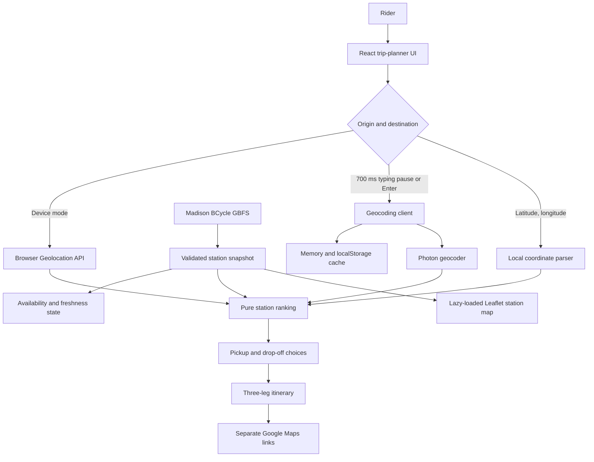

# BRouter

[Open the deployed application](https://bcycle-router.netlify.app/)

BRouter is an independent, static trip-planning aid for Madison, Wisconsin's
BCycle system. It addresses a practical bike-share problem: a useful trip needs
both a rentable bike near the starting point and an open return dock near the
destination.

The app combines live GBFS station availability with a user-entered or
device-provided origin and destination. It ranks nearby pickup and drop-off
choices, lets the rider choose alternatives, and creates up to three separate
Google Maps links for the walking, cycling, and final walking legs. BRouter does
not unlock bikes, reserve equipment, or calculate turn-by-turn routes itself.

<p align="center">
  <video
    src="https://github.com/user-attachments/assets/e3689c4c-f612-4196-b2c7-ded43c66002c"
    width="960"
    height="540"
    controls
    muted
    loop
    playsinline
  >
    Your browser does not support the video tag.
  </video>
</p>

## What the app does

- Resolves an origin manually or through the browser's Geolocation API.
- Runs origin and destination address search after a 700 ms typing pause once
  at least three characters are present. Enter selects the first visible result;
  latitude/longitude input is validated locally without a geocoding request.
- Bounds all address requests to the current station area and removes matches
  farther than one mile from every installed station.
- Loads and validates Madison BCycle station information and status feeds.
- Distinguishes operational, no-bike, no-dock, service-disabled, stale, and
  unavailable states without treating zero bikes as a seasonal closure.
- Recommends up to three eligible pickup stations and three eligible drop-off
  stations within one mile, with the first option selected by default.
- Updates the itinerary immediately when the rider chooses another station.
- Shows an optional, lazy-loaded Leaflet map and an approximate station-coverage
  hull. This visualization is not an official service boundary.
- Installs as a PWA. The compiled app shell can load offline, while live station
  planning still requires a network connection.

## Architecture and data flow

The application is a browser-only React and TypeScript SPA. It has no backend,
account system, private API key, or server-side data store.



Responsibilities are intentionally separated:

- `src/lib/gbfs.ts` loads, validates, caches, and timestamps station snapshots.
- `src/services/geocodingClient.ts` handles Photon searches, station-area
  bounds and filtering, coordinate parsing, throttling, cancellation, and cache
  persistence.
- `src/lib/stations.ts` contains deterministic station eligibility and ranking.
- `src/lib/tripPlanner.ts` and `src/lib/maps.ts` create the itinerary and its
  correctly scoped map links.
- `src/features/trip-planner/` owns planner state, while focused components
  render search, station choices, service status, results, and the station map.

## Station ranking

Pickup candidates must be installed, enabled for rentals, have valid
coordinates, and report at least one bike. Drop-off candidates must be
installed, enabled for returns, have valid coordinates, and report at least one
dock.

For each endpoint, the ranking algorithm:

1. Calculates Haversine distance to every eligible station.
2. Removes stations farther than the configured 1.0-mile maximum.
3. Always places the closest eligible station first.
4. Adds the true next closest unused station second.
5. For the remaining position, adds the station with the highest relevant
   availability among the unused candidates only when it reports more than the
   closest station: bikes for pickup or docks for drop-off. Otherwise, it uses
   the nearest remaining station.
6. Returns at most three candidates. Effectively identical distances use the
   relevant bike or dock availability first, then stable station IDs.

The first candidate is recommended and selected by default. The chosen pickup
is excluded from drop-off choices when another eligible return station exists.
Each option is labeled to explain whether it is the closest, offers more bikes
or docks, or is the next closest. Selections with only one bike or one dock
receive a visible warning.

## Distances and Google Maps

Every distance shown by BRouter is a **straight-line estimate** calculated with
the Haversine formula. It is not an actual walking distance, cycling distance,
travel time, or guarantee that a route exists.

The result is deliberately split into up to three map handoffs:

1. Walk from the starting location to the selected pickup station.
2. Cycle from the pickup station to the selected drop-off station.
3. Walk from the drop-off station to the final destination.

Walking legs below 0.005 mile, which would display as 0.00 mile, are omitted
because the rider is already at that endpoint. Every remaining leg displays its
endpoints and estimate and opens its own Google Maps URL with the correct
`walking` or `bicycling` travel mode. Google Maps, rather than BRouter,
calculates the routed distance and directions for that individual leg.

## Live station data and freshness

BRouter first checks the Madison BCycle GBFS discovery document and falls back
to documented station-information and station-status endpoints when discovery
cannot resolve both feeds. The feeds are fetched in parallel with an eight-second
request timeout. External JSON is validated at runtime; malformed individual
stations can be skipped safely, negative availability values are clamped to
zero, and an unusable overall feed fails clearly.

A successful load produces a snapshot containing the stations, local fetch
time, provider update time and TTL when present, and a stale flag. Freshness is
derived from provider metadata; a documented 15-second fallback threshold is
used when usable metadata is absent.

Normal loads use a short 15-second in-memory cache and deduplicate concurrent
requests. The app checks again automatically, while the visible Refresh action
bypasses that cache and forces a network request. If a refresh fails after a
valid load, the last successful snapshot remains visible with a warning and its
timestamp. If no valid snapshot exists, the station service is shown as
unavailable.

## Address search, attribution, and privacy

Address results come from [Photon](https://photon.komoot.io/) using OpenStreetMap
data and are limited to five matches. Both address fields search automatically
after the rider pauses typing for 700 ms once at least three characters are
present. Enter remains an immediate shortcut and selects the first visible
result when no result is active. A coordinate pair is parsed locally and must
contain a latitude from -90 through 90 and longitude from -180 through 180.

Address requests use Photon's bounding-box parameter. The box is derived from
current installed station coordinates and expanded by the same one-mile walking
radius used by the planner. Returned points are then filtered locally so a
rectangular bounding box cannot admit a match more than one mile from every
installed station.

The geocoding client normalizes cache keys, keeps a bounded 100-entry memory and
versioned `localStorage` cache for seven days, tolerates unavailable browser
storage, cancels obsolete requests, and spaces outbound Photon requests by at
least one second. Service-area identity is part of bounded cache keys, so stale
matches are not reused after the station area changes. Cached matches may be
reused without another request.

Pausing after at least three characters or pressing Enter sends that text
directly from the browser to Photon, whose operator may receive normal request
metadata such as the user's IP address. BRouter has no application backend and
does not receive or store the query remotely.
[OpenStreetMap contributor attribution](https://www.openstreetmap.org/copyright)
is shown in the map controls whenever the optional map is open.

## Accessibility

- Address search uses semantic forms and a WAI-ARIA combobox/listbox pattern.
- Arrow keys move through results, Enter selects, and Escape closes the list;
  pointer selection remains available.
- Geolocation, geocoding, station refresh, and itinerary changes use polite live
  announcements, while actionable errors are identified separately.
- Logical headings, visible labels, non-color map symbols, strong
  `:focus-visible` styling, WCAG-AA button contrast, and practical touch targets
  support keyboard, screen-reader, and touch use.
- Page zoom and pinch zoom are not disabled.
- Playwright runs Axe checks that fail on serious or critical violations in the
  tested flows.

## Local development

Requires Node.js 20.19 or newer and npm.

```bash
npm ci
npm run dev
```

Vite serves the app at the URL printed in the terminal, normally
`http://localhost:5173/`.

Create and inspect the production build:

```bash
npm run build
npm run preview
```

## Verification commands

```bash
npm run typecheck
npm run lint
npm run format:check
npm test
npm run build
npx playwright install chromium webkit
npm run test:e2e
```

Unit and component tests use Vitest and React Testing Library. End-to-end tests
use Playwright with intercepted local fixtures rather than relying on live
Madison BCycle, Photon, OpenStreetMap, or Google Maps responses.

To apply repository formatting, run `npm run format`.

## Netlify deployment

The checked-in `netlify.toml` is the deployment contract:

- build command: `npm run build`
- publish directory: `dist`
- SPA navigation fallback: `index.html`
- failed JavaScript, CSS, image, icon, manifest, and service-worker asset paths:
  explicit 404 responses rather than the SPA HTML fallback

Connect the repository to a Netlify site and deploy the production branch;
Netlify reads those settings automatically. No environment variables, API keys,
functions, or other backend services are required.

`vite-plugin-pwa` generates the Workbox service worker during the production
build. It precaches the compiled app shell, has no runtime cache for live GBFS or
geocoding responses, and does not use `index.html` as a failed-asset response.

## Limitations

- BRouter supports Madison BCycle only; it is not a multi-city planner.
- The coverage hull is computed from current installed station locations and is
  only an approximation, not an official or complete service boundary.
- Live station reports can be delayed or change between planning and arrival.
  A recommendation does not reserve or guarantee a bike or dock.
- Haversine estimates ignore streets, paths, barriers, elevation, and traffic.
- Google Maps opens each travel leg separately; BRouter does not create one
  mixed-mode route or provide in-app turn-by-turn navigation.
- Device location requires browser support, permission, and normally a secure
  context. A denied, timed-out, or unavailable request can be retried or
  replaced with manual entry. A device location outside the current one-mile
  station area switches directly to manual origin entry.
- The offline PWA shell can explain connection loss, but current station
  availability and uncached address searches require external network services.
- Availability, Photon, map tiles, and Google Maps are subject to their
  providers' uptime, data quality, policies, and coverage.
- The app has no accounts, reservations, payments, bike unlocking, predictive
  availability, or paid routing service.

## Data sources and independence

- [Madison BCycle GBFS discovery](https://gbfs.bcycle.com/bcycle_madison/gbfs.json)
- [Photon](https://photon.komoot.io/)
- [OpenStreetMap](https://www.openstreetmap.org/)
- [Google Maps Directions](https://www.google.com/maps/dir/)

BRouter is an independent project and is not affiliated with, endorsed by, or
operated by Madison BCycle, BCycle, Trek, OpenStreetMap, the Photon service,
or Google. Product names and data sources belong to their respective owners.
